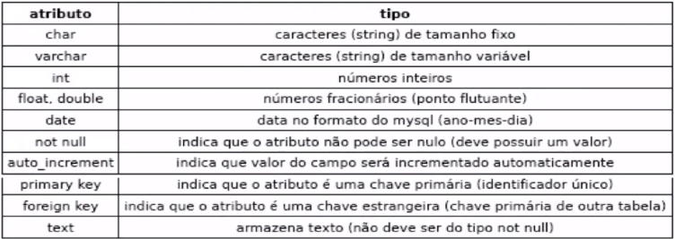
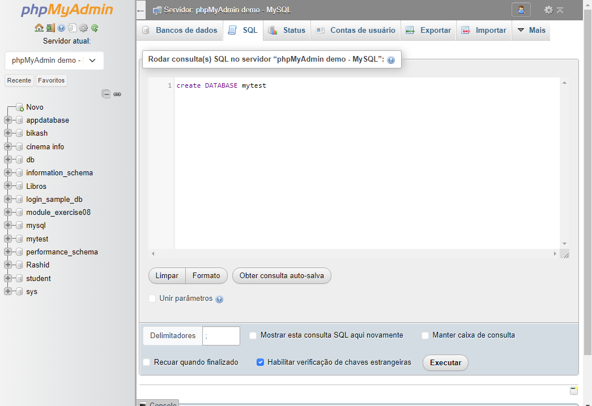
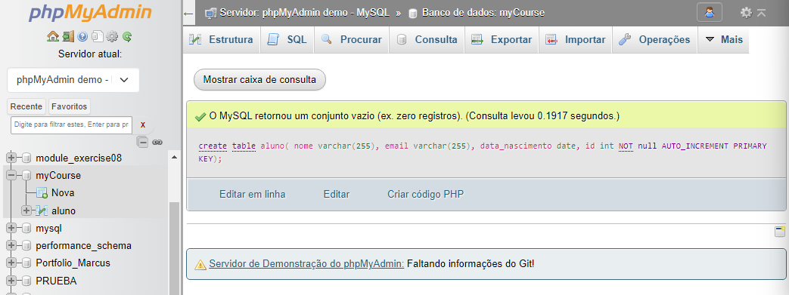
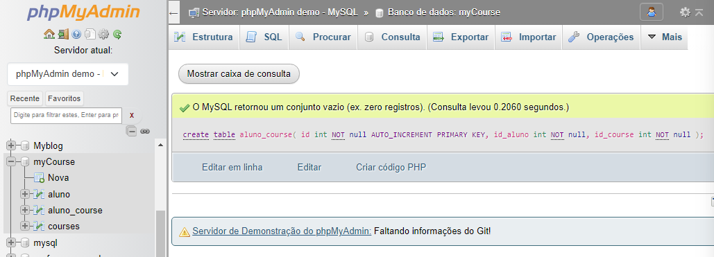
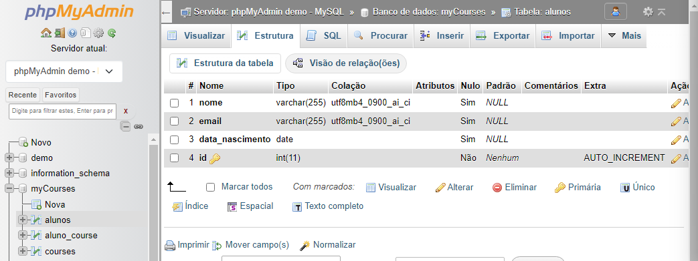

`Section 1: Introdução`
0/28

Introdução a banco de dados com MySQL & PHPMyAdmin
-

Há dois tipos de bancos de dados: 

=> Relacionais e Não relacionais (NOSQL)

    MySQL       |  mongoDB
    ppstgreSQL  |
    oracle      |

>SQL - Structured Query Language
- linguagem de consulta estruturada
- linguagem de pesquisa declarativa padrão para banco de dados relacional
- desenvolvida na decada de 70 pela IBM
 -> Famosos sistemas de gerenciamento de banco de dados:
  - -  MySQL
    -  SQL Server
    -  Maria DB
    -  Cassandra
    -  MongoDB
    -  Voldemort

Exemplo, temos uma tabela "T", usaremos o seguinte comando,

      select * from T
      
*o mesmo pega e ler toda informação da tabela;

=> Bancos de dados relacionais possuem sistemas de gerenciamento.

- Um dos programas mais utilizados é o mySQL, permite o acesso da linguagem SQL atraves de interface;

>PHPMYADMIN
- ferramenta bastante utilizada, acesso ao banco de dados pela internet, atraves de uma interface simples, permite _criar_ e _remover_ banco de dados.
- editar codigos SQL
- remover e alterar tabelas
- editar campos

> Operaçoes CRUD

- Create
- Read
- Update
- Delete

=> criação, consulta, atualização e destruição de dados;

- Para isso usaremos o phpMyAdmin;

> Forma geral do curso
> -

=> DADOS E INFORMAÇÕES => SQL => MYSQL => PHPMYADMIN => GOOGLE CHROME

Caracteristicas de um banco de dados
-

- Transações
  - As transações de um banco de dados devem seguir estas propriedades:

1. Automicidade - ação onde todas ocorrem ou nenhuma.  Rollback - Commit
2. Consistencia
3. Isolamento
4. Durabilidade

> Quiz

1. Banco de dados são conjuntos de bases de dados, que são repositorios de dados;

=> Projetando banco de dados
-

> Estudo de caso

Como construir um banco de dados?

*Tabelas

- Curso
  - Alunos
  - Curso
  - Qual aluno fez qual curso?

- Alunos
  - nome
  - email
  - data de nascimento
  - id (identificador unico)
    - chave primaria (primary key, pk)

- Curso
  - nome
  - curso
  - id(pk)

- Aluno_Curso
  - id (pk)
  - id_aluno
  - id_curso

=> Tipos de dados a serem armazenados nas tabelas

Tabela Alunos

- nome - varchar 255 (quantidades de caracteres)
- email - varchar 255 (quantidades de caracteres)
- data de nascimento - date
- id - int, not null, auto_increment

Tabela Curso

- nome - varchar 255
- curso - varchar 20
- id - int, not null, auto_increment, primary key

Tabela Aluno_Curso

- id - int, not null, auto_increment, primary key
- id_aluno - not null
- id_curso - not null

=> Linguagem SQL
-
_Structure Query Language_ - Linguagem de Consulta Estruturada

* Com ela voce consegue manipular tabela de banco de dados;
* Linguagem de busca em bancos relacionais;

  Dividida em 3 partes:

  1. DML - linguagem de manipulação de dados -  exclusão, inclusão e alteração - Exemlos de comandos: `INSERT`, `UPDATE`, `DELETE`;
  2. DDL - linguagem de definição de dados - criação e alteração - Exemplos de comandos: `CREATE TABLE`, `ALTER TABLE`, `DROP TABLE`;
  3. DQL - linguagem de consulta de dados - busca dados na tabela - Exemplos de comandos: `SELECT`;
     - buscas podem ser melhoradas com clausulas:
       - `SELECT * FROM TABELA`, _busca todos os dados na tabela 'TABELA'_;
       - outras clausulas:
         - `WHERE`, indica condições;
         - `GROUP BY`, realiza agrupamentos;
         - `ORDER BY`, ordena os dados;
    - ainda podemos combinar buscas com operadores logicos:
      - `AND`, avalia se duas condições são verdadeiras;
      - `OR`, avalia se uma condição é verdadeira;
      - `NOT`, negação;
    - operadores relacionais permitem fazer comparações nas consultas:
      - `<` menor
      - `>` maior
      - `<=` menor ou igual
      - `>=` maior ou igual
      - `=` igual
      - `<>` diferente

=> Comando de criaçao
-
`CREATE` - CRIAR
-
  - Comando do tipo DDL (Data Definition Language) ou Linguagem de definiçao de dados
    - Exemplo: `CREATE DATABASE <name data base>`
    - `CREATE TABLE <name table>`

> Entry with link: https://www.phpmyadmin.net/try/

* Vamos usar servidor de teste do phpMyAdmin
  * https://demo.phpmyadmin.net/master-config/public/
    * demo - servidor de `demonstração`

- Criamos a base de dados.
  
=> O que é o PHPMyAdmin?
-
  - software livre, escrito em php com a função de administrar o MySql atraves da web.
    - site oficial: https://www.phpmyadmin.net/

- Criamos a tabela 'aluno'.

- as 3 tabelas já foram criadas;

=> Renomeando tabelas
-

    rename table aluno to alunos
- Renomear tabela `aluno` para `alunos`

=> DROP vs DELETE
-
  - DROP, derrubar, soltar, jogar
    - na linguagem SQL ele é do tipo DDL(Data Definition Language) ou linguagem de definição de dados.
      - use ele para excluir tabelas e base de dados.
  - DELETE, apagar, deletar
    - na linguagem SQL ele é do tipo DML (Data Manipulation Language) ou linguagem de manipulação de dados.
      - use para deletar dados em tabela.

=> INSERT: INSERIR
-
  - Na linguagem SQL usa-se o `INSERT` para inserir dados em uma tabela;
    - `INSERT`, é um comando do tipo _DML_ ;

Veja um exemplo de inserção de dados:

    INSERT ALUNOS(NOME, EMAIL, DATA_NASCIMENTO)
    VALUES("TIAGO", "TIAGO@DOC.UFMG.BR", "1999-07-11")

*Observe o dado data de nascimento é, deve ser no padrão americano(ano-mes-dia);  

=> Comando para apagar dados
-
    DELETE FROM ALUNOS WHERE ID = 2

*Explicando: 

- - Delete de tabela `ALUNOS` onde o `ID` - identificador é igual a 2

=> Comando de seleção
-

Na linguagem SQL podemos usar o comando SELECT para `ler` dados de tabelas.
- - Comando do tipo DQL(Data Query Languagem - Liguagem de `Consulta` de Dados)
  - Exemplo:

        SELECT * FROM ALUNOS

*Explicando:

- - Selecione * (o asterisco quer dizer todos os campos) de tabela `ALUNOS`;

-> Agora vamos fazer uma busca diferente. Selecionar, consultar apenas a coluna nome na tabela. Como ficaria isso?

    SELECT NOME FROM ALUNOS

*A partir dessse comando deve aparecer apenas os nomes, os dados dessa coluna `NOME`, da tabela `ALUNOS`;

-> Agora eu quero filtrar a palavra, o nome _Maria_. Como fazemos isso?

    SELECT * FROM ALUNOS WHERE NOME = "Maria" 

-> E se, eu quiser buscar pelo nome _Maria_ com algums diferenças? Por exemplo, _Maria da Conceiçãp_, ou _Ana Maria_, perceba que há diferença antes e depois certo.

    SELECT * FROM ALUNOS WHERE NOME LIKE "%Maria%"

*O comando `LIKE` + o valor de % quer dizer qualquer coisa antes ou depois do nome _Maria_;

=> Buscas avançadas
-
-> buscas com operadores logicos

    SELECT * FROM ALUNOS WHERE DATA_NASCIMENTO > "1991-03-01"

*Explicando:
- - A  busca aqui foi de todos os alunos nascidos depois do dia 1º de março de 1991;

-> Avançando mais

    SELECT * FROM ALUNOS WHERE DATA_NASCIMENTO > "1991-03-01" OR NOME LIKE "%Maria%"

*Usamos o operador `OR` para buscar, filtrar um valor ou outro.

=> Comando de atualização

> UPDATE : atualizar

Na linguagem SQL, podemos utilizar o comando `UPDATE` para atualizar dados em uma tabela.
Comando do tipo DML(Data Manipulation Language - Linguagem de Manipulação de dados);

-> Em uma tabela 'x' na coluna 'y' quero alterar o nome da aluna 'Maria'. Como faremos isso em um bando de dados relacional?

    UPDATE ALUNOS SET NOME = "Maria Santos" WHERE ID = 5

*Explicando:
- - Começamos com o comando que altera `UPDATE`, na tabela _ALUNOS_, defina o campo que será mudado com o comando `SET`, nome do campo _NOME_, que recebe o novo valor _"Maria Santos"_, precisa definir onde, qual é o `ID`;
    
> -> CURIOSITY
>- - _UPDATE_ atualiza dados de uma tabela, enquanto _ALTER_ é um comando de definição de dados.
 
 

=> Inserção na tabela alunos_cursos
-

    INSERT INTO ALUNOS_CURSOS(ID_CURSO, ID_ALUNO) VALUES (1,1) 

-> `Busca` que envolve duas tabelas

Pela palavra chave "Busca", que destaquei já podemos imaginar qual o 1º comando:

    SELECT ALUNOS.NOME, CURSOs.NOME FROM ALUNOS, CURSOS, ALUNOS_CURSOS WHERE ALUNOS.ID = ALUNOS_CURSOS.ID_ALUNO AND CURSOS.ID = ALUNOS_CURSOS.ID_CURSO

*Explicando:
- - busque,  `SELECT` pelas colunas 'x', 'y';
  - devemos indicar onde deve buscar essas colunas, então use o `FROM` e chame as tabelas 'x','y','z';
  - a partir dessas tabelas precisamos indicar com o comando `WHERE`;
  - estamos procurando dados iguais, desta forma usaremos os operadores logicos de comparação;

> Quiz final

- 2/10
  - - Empresas que desenvolveram a linguagem SQL e o SGBD MySQL:
    - IBM e MySQL AB
